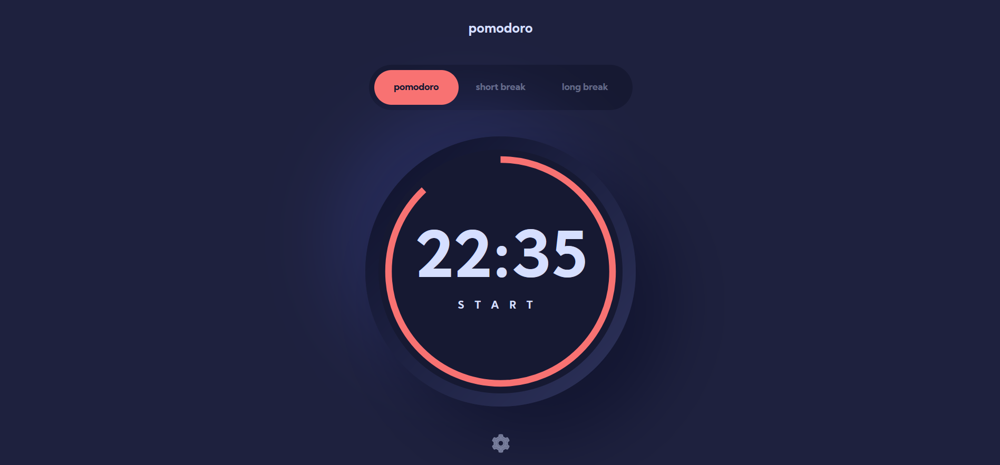

# Frontend Mentor - Pomodoro app solution

This is a solution to the [Pomodoro app challenge on Frontend Mentor](https://www.frontendmentor.io/challenges/pomodoro-app-KBFnycJ6G). Frontend Mentor challenges help you improve your coding skills by building realistic projects. 

## Table of contents

1. [Frontend Mentor - Pomodoro app solution](#frontend-mentor---pomodoro-app-solution)
	1. [Table of contents](#table-of-contents)
		1. [The challenge](#the-challenge)
		2. [Screenshot](#screenshot)
		3. [Links](#links)
		4. [Built with](#built-with)
		5. [Continued development](#continued-development)
	2. [Author](#author)

### The challenge

Users should be able to:

- Set a pomodoro timer and short & long break timers
- Customize how long each timer runs for
- See a circular progress bar that updates every minute and represents how far through their timer they are
- Customize the appearance of the app with the ability to set preferences for colors and fonts

### Screenshot

### Links

- Solution URL: [Frontend mentor](https://www.frontendmentor.io/solutions/pomodoro-app-with-reactjs-and-tailwindcss-6ZOiJUtQY)
- Live Site URL: [Live site](https://pomodoro-app-zynth17.vercel.app/)

### Built with

- Semantic HTML5 markup
- CSS custom properties
- Flexbox
- Mobile-first workflow
- SCSS
- CSS Module
- [React](https://reactjs.org/) - JS library
- [TailwindCSS](https://tailwindcss.com) - CSS Utility Library
- [React Icons](https://react-icons.github.io/react-icons/) - Icons Library
### Continued development

this project sadly does not run on the background so i will try to find out how to make it run on background when i have time

## Author

- Website - [creeve.me](https://creeve.me)
- Frontend Mentor - [@zynth17](https://www.frontendmentor.io/profile/zynth17)
- Twitter - [@hi_reeve](https://twitter.com/hi_reeve)
- Instagram - [@hi_reeve](https://www.instagram.com/hi_reeve/)
- Github - [zynth17](https://github.com/zynth17)